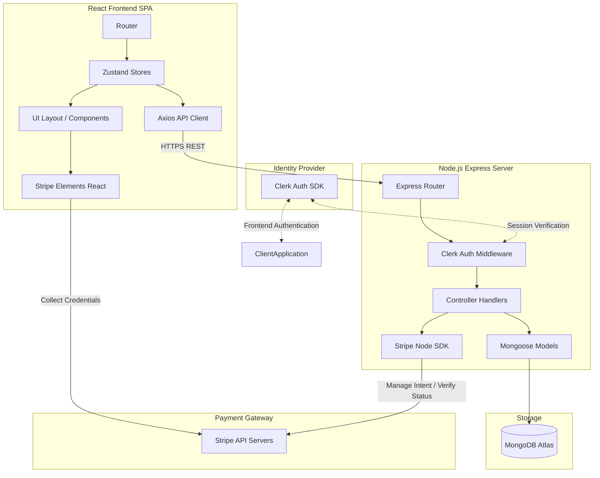

# High-Level System Architecture

This document describes the high-level software architecture, module organization, and design patterns used in the E-Commerce system.

---

## 1. System Topology

The system follows a classic **decoupled Client-Server Architecture** communicating over a RESTful JSON API. 



---

## 2. Key Components

### 2.1. Frontend Single Page Application (`/client`)
* **Framework**: React 19 + TypeScript + Vite.
* **Styling**: Tailwind CSS + `shadcn/ui` components for unified component tokens.
* **State Management**: **Zustand** stores handle client-side reactive state (Cart, Checkout, Profile, Products).
* **Routing**: React Router DOM (v7) managing authenticated customer layouts and private admin dashboards.
* **Identity Management**: Clerk React SDK for social and email-based authentication.

### 2.2. Backend REST API (`/server`)
* **Runtime**: Node.js + Express + TypeScript.
* **Server Middleware**:
  * Clerk Express Middleware for secure token extraction and user session population.
  * Custom Global Error Handler (`errorHandler.ts`) to intercept uncaught exceptions and format standardized JSON envelopes.
* **Validation**: Schema-level mongoose validation rules and custom sanitization helpers.

### 2.3. Data & Payment Integrations
* **Database**: MongoDB Atlas queried natively using **Mongoose ODM**.
* **Payments**: Stripe API integration using the **PaymentIntents API** (eliminating the need for custom PCI DSS handling by keeping credit card fields securely sandboxed inside Stripe Elements iframe fields).

---

## 3. Core Architectural Patterns

### Standardized Response Envelope
All backend endpoints wrap output in a consistent JSON response envelope defined in `utils/envelope.ts`. This allows frontend consumers to predict the response payload structure safely:
```json
{
  "status": "success",
  "data": { ... },
  "meta": { ... }
}
```

### Decoupled Cart Storage
To optimize user experience for non-authenticated browsers:
* **Guest State**: Cart items are saved directly in local storage.
* **Signed-In State**: Upon successful Clerk sign-in, the frontend syncs the guest cart payload to MongoDB via `/customer/cart/sync`, merging local items with existing database items, and switching state retrieval to database queries.

### Payment Reconciliation
Checkout follows a **Three-Way Handshake** pattern to secure transactions:
1. **Creation**: The server initializes a Stripe PaymentIntent and MongoDB Order in a `pending` status. The Stripe Intent ID is mapped directly to the Order's `stripePaymentIntentId`.
2. **Execution**: The client displays Stripe's `PaymentElement` card iframe, collects card details, and submits to Stripe.
3. **Verification**: After Stripe returns a successful checkout status, the client triggers the backend `/confirm-stripe` route. The backend calls Stripe's API to fetch the PaymentIntent status and reconciles it against the database Order before updating stock levels and clearing the cart.
