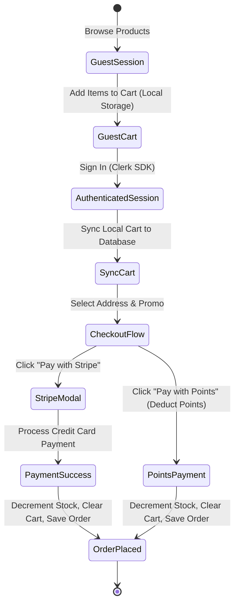

# Core Business Logic & User Journeys

This document details the functional specifications, checkout formulas, point rules, discount mechanisms, and admin validation constraints of the E-Commerce platform.

---

## 1. Customer User Journeys



---

## 2. Cart Synchronization Logic

Carts are stored in two locations to support offline/non-signed-in users seamlessly:
* **Guest Users**: Items are written to `localStorage` under the key `guest_cart_items` in the browser.
* **Signed-In Users**: Items are read/written directly to MongoDB.

### Cart Merger Algorithm
When a user registers or logs in:
1. The client reads guest cart items from `localStorage`.
2. If there are items, the client invokes `POST /customer/cart/sync`.
3. The server merges the guest items with the user's existing DB cart:
   * If a product already exists in the DB cart (with the same color and size options), the quantities are added together.
   * If a product does not exist, it is appended to the items array.
4. The client clears the local `guest_cart_items` local storage key.

---

## 3. Pricing & Discounts Calculation

All monetary values are calculated in integers (subunits, paisei/cents) to avoid standard floating-point arithmetic errors.

### Checkout Calculations Formulations
For each item in the cart:
$$\text{Final Price} = \text{Product Price} \times \left(1 - \frac{\text{Sale Percentage}}{100}\right)$$
$$\text{Item Subtotal} = \text{Final Price} \times \text{Quantity}$$
$$\text{Subtotal} = \sum \text{Item Subtotal}$$

If a promo code is applied:
$$\text{Discount Amount} = \text{Subtotal} \times \left(\frac{\text{Promo Percentage}}{100}\right)$$
$$\text{Total Amount} = \max(\text{Subtotal} - \text{Discount Amount}, 0)$$

---

## 4. Loyalty Program Rules (Pay with Points)

Customers earn and spend loyalty points to purchase items.
* **Points Balance Check**: Before starting checkout, the store checks if the customer's `points` balance is greater than or equal to the order's `totalAmount` in INR (conversion: **1 point = 1 INR**).
* **Payment Deductions**: During order confirmation, the backend runs a query that atomically decrements the points balance:
  ```typescript
  await User.updateOne(
    { _id: dbUser._id, points: { $gte: totalAmount } },
    { $inc: { points: -totalAmount } }
  );
  ```
* **Failure Safety**: If product stock runs out during the database update transaction, the points are rolled back and re-credited to the user's account automatically.

---

## 5. Promo Code Rules

Coupons are strictly validated according to three criteria:
1. **Time Limits**: Current date must fall within `startsAt` and `endsAt` boundaries.
2. **Usage Limit**: `count` must be greater than `0`. Each checkout success decrements `count` by `1`.
3. **Threshold Boundary**: The total order value (subtotal before discounts) must meet `minimumOrderValue`.
