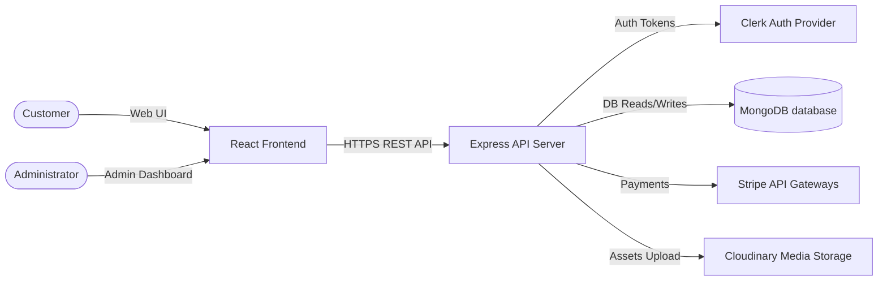

# High-Level Design (HLD) Document

This High-Level Design (HLD) document outlines the architectural boundaries, system components, integrations, and deployment layout of the E-Commerce platform.

---

## 1. System Context & Boundaries

The E-Commerce platform is a modular web application designed to support product exploration, cart management, discount code applications, and payment integrations.

---

## 2. Shared Architecture & Modularity

The codebase is strictly separated into modular sub-systems representing dedicated business boundaries:

1. **Authentication & Profile Service**: Identity provider mapping, user profiles, address management, and loyalty points.
2. **Product Catalog Service**: Category taxonomies, brand/size inventory filtering, active/inactive listings, and admin dashboard creation.
3. **Cart & Wishlist Service**: Session-based guest local storage, database sync on login, and validation against real-time product stock.
4. **Checkout & Order Service**: Stripe credit card processing, loyalty points checkout, order registration, inventory deduction, and payment verification.
5. **Promo & Coupons Service**: Time-bounded discounts, minimum order threshold validation, and single-use usage caps.

---

## 3. Communication Patterns

### 3.1. RESTful JSON API
All micro-capabilities communicate via asynchronous HTTPS REST APIs. Sub-system boundaries do not bypass controllers; the client coordinates frontend state using zustand stores mapping to REST responses.

### 3.2. Clerk Authentication Lifecycle
1. User authenticates on the frontend via Clerk's pre-built UI components.
2. Clerk generates a short-lived JSON Web Token (JWT) session token.
3. The frontend includes this token in the `Authorization: Bearer <JWT>` header of all backend requests.
4. Express middleware `requireAuth` calls Clerk API to decrypt and validate the signature before proceeding to controllers.

---

## 4. Key Cross-Cutting Concerns

### 4.1. Security & Compliance
* **Payment Credentials**: Credit card data is collected via Stripe's sandboxed `PaymentElement` iframe. Private keys never touch our database, ensuring full **PCI-DSS Level 1 compliance**.
* **Authentication**: Clerk handles cryptography, brute-force protection, and multi-factor auth (MFA).

### 4.2. Data Consistency (Order Placement)
Order confirmation uses a transactional checklist pattern to guarantee consistency:
* **Product Stock Validation**: The product collection enforces inventory counts before updating (`stock: { $gte: quantity }`).
* **Promo Coupon Limits**: Redemptions decrement atomically (`count: { $gt: 0 }`).
* **Cart Purging**: The cart collection is cleared in a single atomic transaction.
