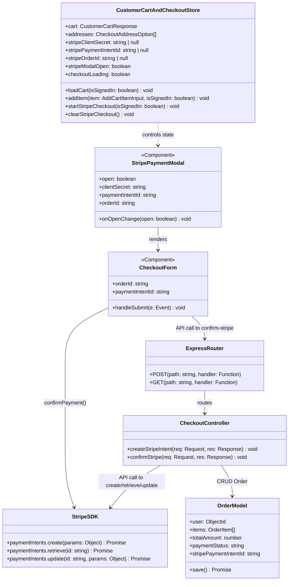
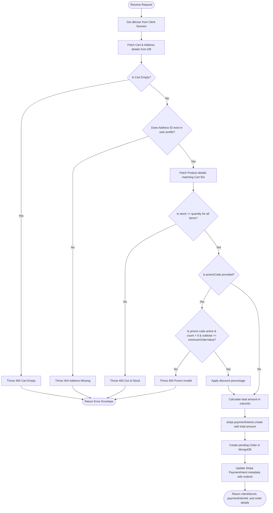

# Low-Level Design (LLD) Specification

This document provides the Low-Level Design (LLD) specification for the E-Commerce platform, outlining class structures, data schemas, API interfaces, store states, and algorithmic flows.

---

## 1. Class & Component Diagram

The following diagram illustrates the interaction between React UI layers, Zustand stores, REST clients, Express controllers, and Mongoose models.



---

## 2. Exhaustive API Interface Specifications

All responses return in the standard envelope: `ApiEnvelope<T> = { status: "success" | "error"; data: T | null; meta?: Record<string, unknown>; errors?: Array<{ message: string; code?: string }> }`.

| Endpoint | Method | Auth | Request Body | Response Data (On Success) | Common Errors / Status |
| :--- | :--- | :--- | :--- | :--- | :--- |
| `/customer/checkout/create-stripe-intent` | `POST` | Clerk Bearer | `{ addressId: string, promoCode?: string }` | `{ stripe: { clientSecret: string, paymentIntentId: string }, order: { _id: string, totalItems: number, totalAmount: number } }` | `400: Cart empty / Out of stock`<br>`404: Address/Promo not found`<br>`401: Unauthorized` |
| `/customer/checkout/confirm-stripe` | `POST` | Clerk Bearer | `{ orderId: string, paymentIntentId: string }` | `{ _id: string }` | `400: Stripe intent failed`<br>`400: Intent ID mismatch`<br>`400: Out of stock`<br>`404: Order not found` |
| `/customer/checkout/pay-with-points` | `POST` | Clerk Bearer | `{ addressId: string, promoCode?: string }` | `{ _id: string, totalPoints: number }` | `400: Insufficient points`<br>`400: Out of stock` |
| `/customer/cart/sync` | `POST` | Clerk Bearer | `{ items: Array<{ productId: string, quantity: number, color?: string, size?: string }> }` | `CustomerCartResponse` | `401: Unauthorized`<br>`400: Invalid payload` |

---

## 3. Database Schema Models (Detailed)

### 3.1. Order Schema (`models/Order.ts`)
Tracks absolute payment logs and shipping details.

```typescript
export type Order = {
  user: Types.ObjectId;
  customerName: string;
  customerEmail: string;
  items: Array<{ product: Types.ObjectId; quantity: number }>;
  totalItems: number;
  deliveryName: string;
  deliveryAddress: string;
  promoCode?: string;
  discountAmount: number;
  totalAmount: number;
  paymentStatus: "pending" | "paid" | "failed";
  orderStatus: "placed" | "shipped" | "delivered" | "returned";
  stripePaymentIntentId: string;
  paymentId?: string;
  paidAt?: Date | null;
  deliveredAt?: Date | null;
  returnedAt?: Date | null;
  createdAt: Date;
  updatedAt: Date;
};
```

| Field Name | Mongoose Type | Validation Rules | Purpose |
| :--- | :--- | :--- | :--- |
| `user` | `Schema.Types.ObjectId` | `ref: "User"`, `required: true` | Link to customer profile |
| `items` | `[OrderItemSchema]` | Min: 1 item | List of products purchased |
| `deliveryName` | `String` | `required: true`, `trim: true` | Recipient full name |
| `deliveryAddress` | `String` | `required: true`, `trim: true` | Full shipping address block |
| `totalAmount` | `Number` | `required: true`, `min: 0` | Net paisei/cents billed |
| `paymentStatus` | `String` | Enum: `["pending", "paid", "failed"]`, default: `"pending"` | Billing status |
| `orderStatus` | `String` | Enum: `["placed", "shipped", "delivered", "returned"]`, default: `"placed"` | Fulfillment stage |
| `stripePaymentIntentId` | `String` | `required: true`, `unique: true`, `trim: true` | Stripe transaction record |

* **Indices**:
  * `createIndex({ user: 1, createdAt: -1 })`
  * `createIndex({ orderStatus: 1, createdAt: -1 })`
  * `createIndex({ paymentStatus: 1, createdAt: -1 })`

---

## 4. Algorithmic Control Flows

### 4.1. Stripe Intent Creation Flow Chart
This algorithm outlines the backend execution flow during PaymentIntent allocation:


