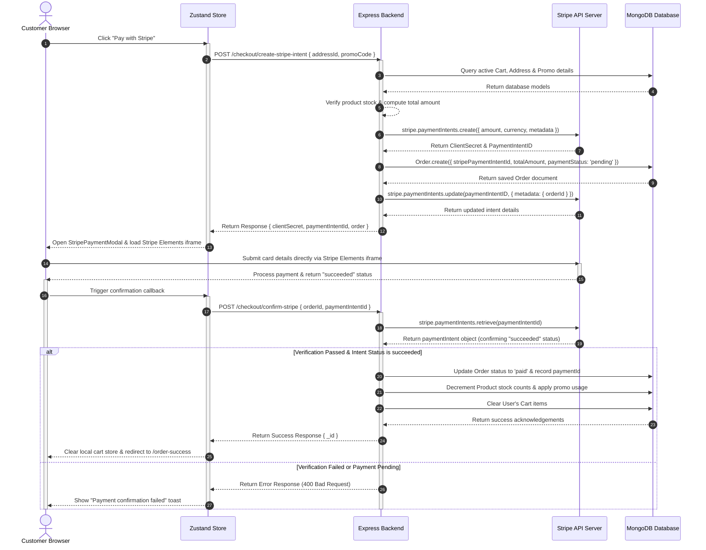

# Checkout & Payment Integration Flow

This document details the Stripe payment integration flow, including how the frontend, backend, Stripe API, and MongoDB Database coordinate to securely process orders.

---

## 1. Sequence Diagram: Stripe Payment Flow

The diagram below outlines the standard flow of creating a checkout session, collecting credit card credentials, and verifying the transaction on the backend.

---

## 2. Step-by-Step Flow Explanation

### Step 1: Session Initiation
The customer triggers checkout in the checkout drawer by clicking the **Pay with Stripe** action button. The Zustand store dispatches a request containing the default shipping address ID and any active promo code.

### Step 2: Backend Valuation & Order Reservation
The backend `/checkout/create-stripe-intent` route validates that the cart is not empty, products are active and in stock, and the promo code is active. It calculates the final total amount in the database (ensuring the user cannot manipulate prices from the client).

### Step 3: Stripe Intent Allocation
The backend allocates a unique **PaymentIntent** on Stripe's servers using the verified database total amount. Stripe returns a `clientSecret` representing this pending transaction.

### Step 4: MongoDB Pending Order Creation
The backend stores the Order document inside the MongoDB database with `paymentStatus` set to `"pending"`. It writes the Stripe PaymentIntent ID directly to the `stripePaymentIntentId` field (which is required by the schema).

### Step 5: Element Iframe Rendering
The frontend receives the `clientSecret` and opens the `<StripePaymentModal>` dialog. It loads Stripe Elements securely inside an iframe. Card details are processed directly on Stripe's servers, which keeps our application fully **PCI DSS compliant**.

### Step 6: Backend Transaction Verification
After Stripe processes the transaction and returns a successful callback, the frontend calls `/checkout/confirm-stripe`. The backend does not trust the client callback blindly: it retrieves the PaymentIntent directly from Stripe's servers to verify its status is `"succeeded"` and metadata matches the database order before releasing the goods (decrementing product stocks and clearing the cart).
