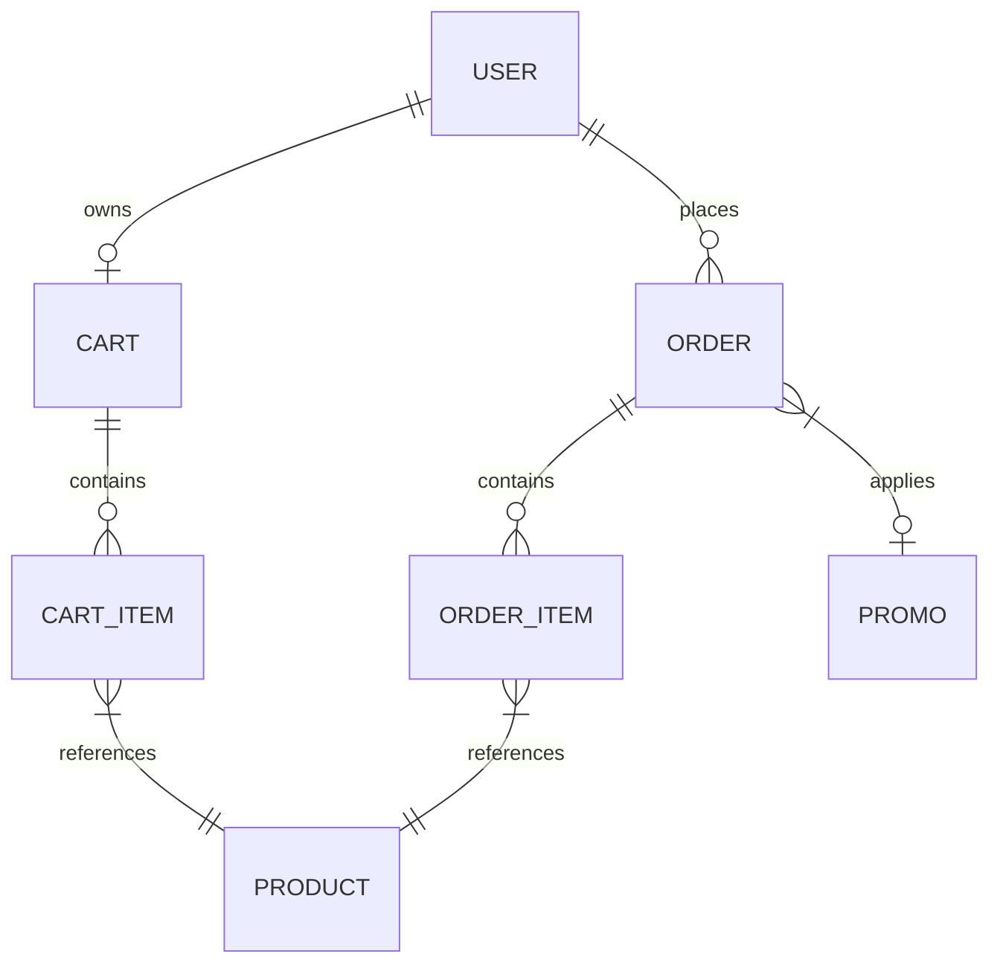

# Database Schemas & Indexing Model

This document maps out the MongoDB database design, Mongoose models, and indexing strategies used in the E-Commerce application.

---

## 1. Entity Relationship Overview

The diagram below outlines how the primary entities relate to each other:

---

## 2. Model Schemas

### 2.1. User Model (`User`)
Represents customer and admin profiles synchronized with Clerk credentials.
* **Fields**:
  * `clerkUserId` (String, required, unique): Clerk Auth unique user ID reference.
  * `name` (String, default: `""`): Full name.
  * `email` (String, required, unique, lowercase): Contact email.
  * `role` (String, enum: `["customer", "admin"]`, default: `"customer"`): RBAC role.
  * `points` (Number, default: `0`): Loyalty program points balance.
  * `addresses` (Array of sub-documents):
    * `fullName` (String, required)
    * `address` (String, required)
    * `state` (String, required)
    * `postalCode` (String, required)
    * `isDefault` (Boolean, default: `false`)

### 2.2. Product Model (`Product`)
Catalog products available for purchase.
* **Fields**:
  * `title` (String, required, trim)
  * `description` (String, required)
  * `price` (Number, required, min: 0): Base unit price.
  * `salePercentage` (Number, default: 0, min: 0, max: 100): Price discount markdown.
  * `images` (Array of Strings, default: `[]`): Cloudinary URL paths.
  * `category` (ObjectId referencing `Category`, required)
  * `brand` (String, required)
  * `sizes` (Array of Strings, enum: `["XS", "S", "M", "L", "XL", "XXL"]`, default: `[]`)
  * `colors` (Array of Strings, default: `[]`)
  * `stock` (Number, required, default: 0, min: 0): Real-time inventory count.
  * `isFeatured` (Boolean, default: `false`)
  * `status` (String, enum: `["active", "inactive"]`, default: `"active"`)

### 2.3. Cart Model (`Cart`)
Stores checkout candidate items for signed-in users.
* **Fields**:
  * `user` (ObjectId referencing `User`, required, unique)
  * `items` (Array of sub-documents):
    * `product` (ObjectId referencing `Product`, required)
    * `quantity` (Number, required, min: 1)
    * `color` (String, optional)
    * `size` (String, enum: sizes, optional)

### 2.4. Promo Model (`Promo`)
Discounts applicable at checkout.
* **Fields**:
  * `code` (String, required, unique, uppercase, trim)
  * `percentage` (Number, required, min: 0, max: 100)
  * `count` (Number, required, min: 0): Number of times coupon can be redeemed.
  * `minimumOrderValue` (Number, default: 0, min: 0)
  * `startsAt` (Date, required)
  * `endsAt` (Date, required)

### 2.5. Order Model (`Order`)
Immutable receipt of completed transaction.
* **Fields**:
  * `user` (ObjectId referencing `User`, required): Buyer reference.
  * `customerName` (String, default: `""`)
  * `customerEmail` (String, default: `""`)
  * `items` (Array of sub-documents):
    * `product` (ObjectId referencing `Product`, required)
    * `quantity` (Number, required, min: 1)
  * `totalItems` (Number, required)
  * `deliveryName` (String, required)
  * `deliveryAddress` (String, required): Combined address block.
  * `promoCode` (String, default: `""`, uppercase)
  * `discountAmount` (Number, default: 0)
  * `totalAmount` (Number, required): Net amount charged.
  * `paymentStatus` (String, enum: `["pending", "paid", "failed"]`, default: `"pending"`)
  * `orderStatus` (String, enum: `["placed", "shipped", "delivered", "returned"]`, default: `"placed"`)
  * `stripePaymentIntentId` (String, required, unique, trim): Stripe payment identifier reference.
  * `paymentId` (String, default: `""`): Stripe resolved transaction/charge ID.
  * `paidAt` (Date, default: `null`)
  * `deliveredAt` (Date, default: `null`)
  * `returnedAt` (Date, default: `null`)

---

## 3. Database Indexes

To guarantee high performance and fast query lookups under heavy user traffic, the collections utilize targeted single-field and compound indexes.

### Order Collection
* **`{ user: 1, createdAt: -1 }`**: Speeds up fetching order histories for individual profiles ordered chronologically.
* **`{ orderStatus: 1, createdAt: -1 }`**: Optimizes the Admin portal order sorting and fulfillment dashboards.
* **`{ paymentStatus: 1, createdAt: -1 }`**: Used by automated cron tasks to sweep and cancel long-standing unpaid pending orders.

### User Collection
* **`{ clerkUserId: 1 }`** (Unique): High-speed query to resolve user details from Clerk authentication context.
* **`{ email: 1 }`** (Unique): Enforces login email uniqueness.

### Product Collection
* **`{ category: 1, status: 1 }`**: Speeds up loading specific collection lists filtered by status.
* **`{ isFeatured: 1, status: 1 }`**: Speeds up fetching featured landing page grids.

### Promo Collection
* **`{ code: 1 }`** (Unique): High-speed validate lookup for checkout promo applications.
