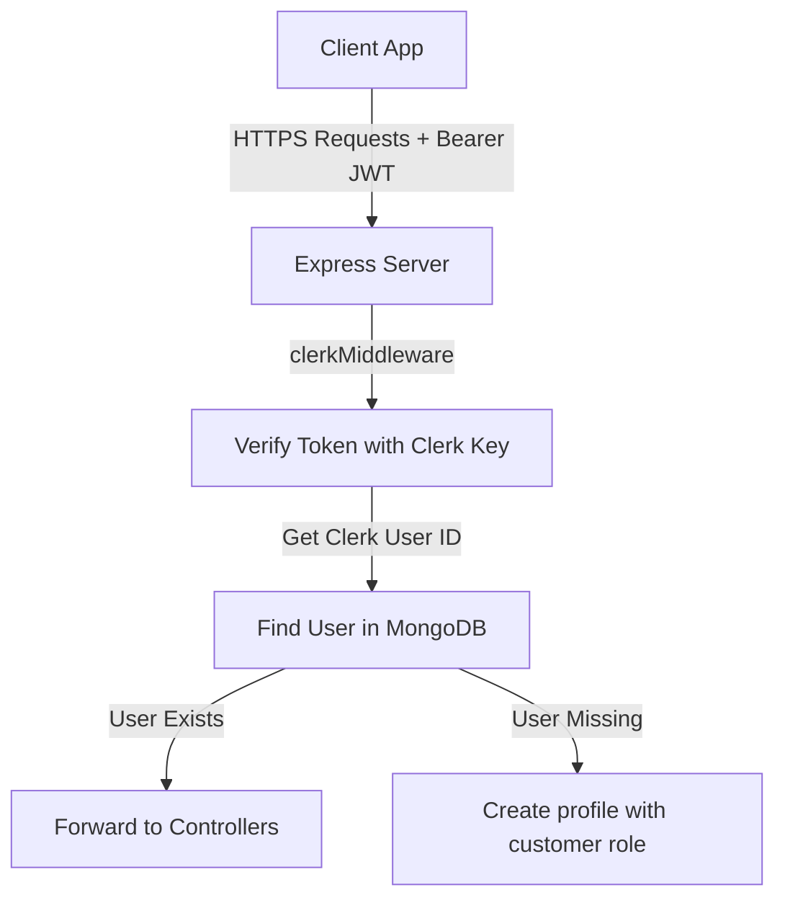

# Authentication & Profile Service Documentation

This service manages customer/administrator credentials, session state verification, profile addresses, and loyalty points.

---

## 1. High-Level Design (HLD)

The service acts as the gateway for all authenticated traffic. It maps the user's Clerk session to their localized MongoDB database profile.

---

## 2. Low-Level Design (LLD)

### 2.1. File Components
* **Schema Definition**: [`server/src/models/User.ts`](file:///c:/Ashish/E-Commerce/server/src/models/User.ts)
* **Auth Middleware**: [`server/src/middleware/auth.ts`](file:///c:/Ashish/E-Commerce/server/src/middleware/auth.ts)
* **Routes Mappings**: [`server/src/routes/customer/address.routes.ts`](file:///c:/Ashish/E-Commerce/server/src/routes/customer/address.routes.ts)
* **Client Store**: [`client/src/features/auth/store.ts`](file:///c:/Ashish/E-Commerce/client/src/features/auth/store.ts) and [`client/src/features/customer/profile/store.ts`](file:///c:/Ashish/E-Commerce/client/src/features/customer/profile/store.ts)

### 2.2. API Routes
* `GET /customer/profile`: Fetches active user details and address records.
* `POST /customer/profile/address`: Adds a new shipping address.
* `PATCH /customer/profile/address/:id/default`: Toggles default address flag.
* `DELETE /customer/profile/address/:id`: Removes an address.

---

## 3. Business Logic & Rules

* **Auto-Registration (Lazy Sync)**: When a user logs in via Clerk for the first time, the client verifies their profile exists in MongoDB. If not, they are automatically registered as a `"customer"` with `points: 0`.
* **RBAC Controls**: System routes are categorized into Customer vs Admin scopes. Admin routes use `requireAdmin` to check the `role` property in the DB user model, responding with `403 Forbidden` if validation fails.
* **Address Default Rules**: Users can save multiple addresses, but only one can have `isDefault: true`. Adding or updating a default address toggles `isDefault: false` on all other addresses automatically.
