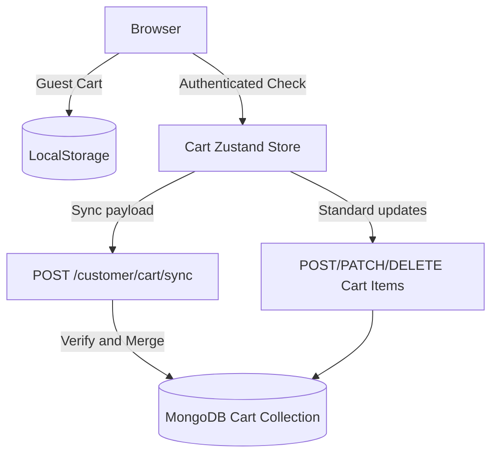

# Cart & Wishlist Service Documentation

This service manages customer candidates for purchases (cart items) and flagged products (wishlist items), synchronizing states across local storage and MongoDB database layers.

---

## 1. High-Level Design (HLD)

The service acts as a buffer between catalog exploration and active order registration.

---

## 2. Low-Level Design (LLD)

### 2.1. File Components
* **Schema Definition**: [`server/src/models/Cart.ts`](file:///c:/Ashish/E-Commerce/server/src/models/Cart.ts) and [`server/src/models/Wishlist.ts`](file:///c:/Ashish/E-Commerce/server/src/models/Wishlist.ts)
* **Routes Mappings**: [`server/src/routes/customer/cart-wishlist.routes.ts`](file:///c:/Ashish/E-Commerce/server/src/routes/customer/cart-wishlist.routes.ts)
* **Client Store**: [`client/src/features/customer/cart-and-checkout/store.ts`](file:///c:/Ashish/E-Commerce/client/src/features/customer/cart-and-checkout/store.ts) and [`client/src/features/customer/wishlist/store.ts`](file:///c:/Ashish/E-Commerce/client/src/features/customer/wishlist/store.ts)

### 2.2. API Routes
* `GET /customer/cart`: Fetches authenticated user's cart.
* `POST /customer/cart/items`: Adds an item to the cart.
* `POST /customer/cart/sync`: Synchronizes and merges guest local storage cart payload into the database.
* `PATCH /customer/cart/items/:id/increase`: Increments quantity.
* `PATCH /customer/cart/items/:id/decrease`: Decrements quantity.
* `DELETE /customer/cart/items/:id`: Removes item from the cart.

---

## 3. Business Logic & Rules

* **Cart Item Identity**: A cart item is uniquely identified by the combination of `productId`, `color`, and `size`. Adding the same product with a different color/size creates a separate cart row.
* **Database Merge Logic**: Upon login, the client pushes the guest local storage cart contents to the server. The server compares the items:
  * For matching `(product, size, color)`, the server combines the quantities.
  * For new items, they are pushed into the user's Mongoose Cart model array.
* **Auto-Validation on Retrieval**: When the checkout drawer is opened, the cart items are cross-referenced with database `Product` records to verify they are still active, exist, and have sufficient stock. Any issues throw warnings on the frontend.
