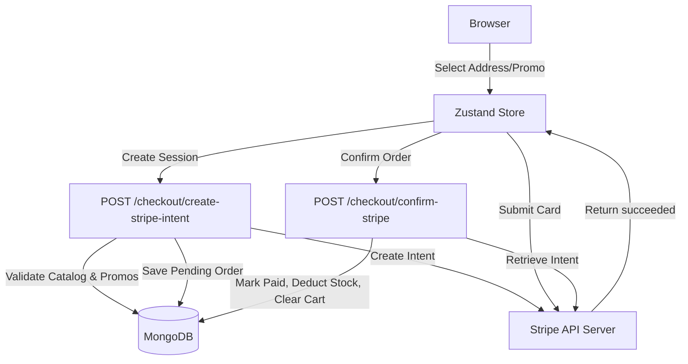
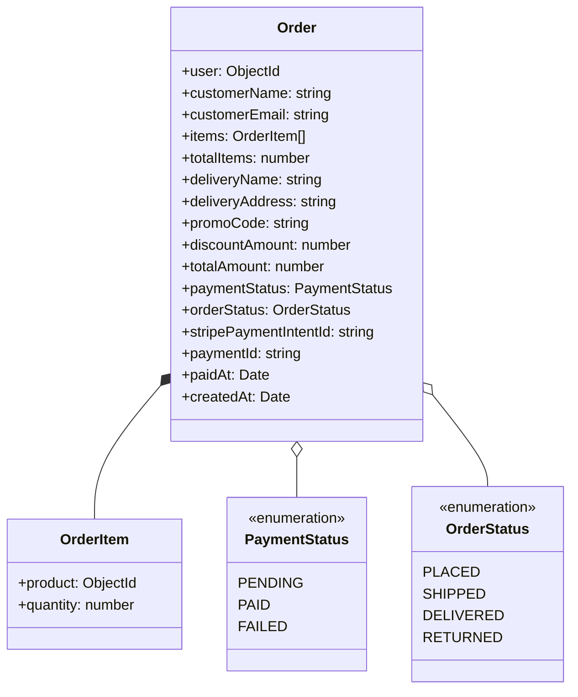
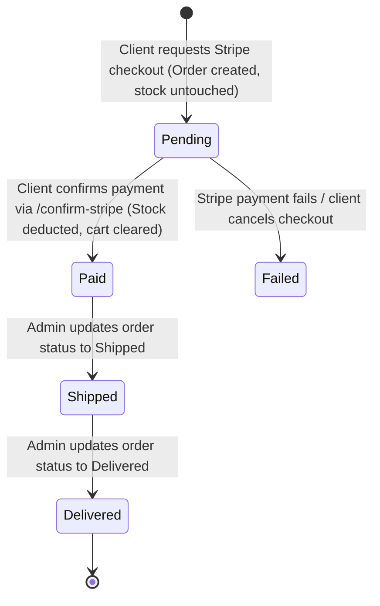

# Checkout & Orders Service Documentation

This service manages the checkout transaction pipeline, processing credit cards via Stripe, managing points-based purchases, and generating immutable order records in MongoDB.

---

## 1. High-Level Design (HLD)

The checkout process coordinates state between Stripe API, customer profiles, product stock, and order logs.



---

## 2. Low-Level Design (LLD)

### 2.1. Class Diagram (UML)
This UML diagram maps the internal types and properties used to configure orders and payment intents.



### 2.2. Database Verification States (State Machine)
The order lifecycle changes states according to payment status:



### 2.3. Endpoints Details

#### `POST /customer/checkout/create-stripe-intent`
* **Headers**: `Authorization: Bearer <JWT_TOKEN>`
* **Request Body**:
  ```json
  {
    "addressId": "6a7b72f982349c76a066bd82",
    "promoCode": "DISCOUNT10"
  }
  ```
* **Step-by-Step Backend Verification Algorithm**:
  1. Retrieve user ID from request JWT token.
  2. Find User in DB. Extract `name`, `email`, and `addresses`.
  3. Find User's Cart items.
  4. Ensure selected address ID is present in the user's saved address profile array.
  5. Fetch `Product` models for all cart items. Check if all items have `stock >= quantity`.
  6. Calculate subtotal using product prices (applying markdown sales).
  7. If `promoCode` is specified, find Promo, verify it is within date range, `count > 0`, and subtotal matches `minimumOrderValue`. Compute discount.
  8. Calculate final total amount in subunits (paisei/cents).
  9. Call Stripe `stripe.paymentIntents.create` with amount and currency `"INR"`.
  10. Create Order in MongoDB with payment status `"pending"` and `stripePaymentIntentId` set to Stripe's payment intent ID.
  11. Call `stripe.paymentIntents.update` to add MongoDB `orderId` to Stripe's metadata for reconciliation tracking.
  12. Send standard success response envelope.

---

## 3. Error Codes & Error Mapping

The service returns standard HTTP status codes along with descriptive error logs:

| HTTP Status | Error Envelope Message | Root Cause |
| :--- | :--- | :--- |
| `400 Bad Request` | `Cart is empty` | User cart has zero items. |
| `400 Bad Request` | `One or more cart items are not avaibale` | Product deleted or marked `"inactive"`. |
| `400 Bad Request` | `Cart items are out of stock` | Cart item quantity exceeds remaining product `stock`. |
| `400 Bad Request` | `promo code is not active` | Current date is outside coupon start/end date range. |
| `400 Bad Request` | `Minimum order value for this promo is not at the threesold` | Order subtotal does not reach required minimum value. |
| `400 Bad Request` | `Stripe payment intent is [status]` | Attempted to confirm order, but Stripe payment status is not `"succeeded"`. |
| `400 Bad Request` | `Payment intent metadata order ID mismatch` | Stripe payment intent metadata `orderId` does not match the requested order. |
| `404 Not Found` | `Address not found!!` | Request `addressId` is missing from user's addresses array. |
| `404 Not Found` | `Promo not found` | Provided `promoCode` does not exist in collection. |
| `401 Unauthorized` | `User is not logged in.` | Bearer token is missing, expired, or invalid. |
