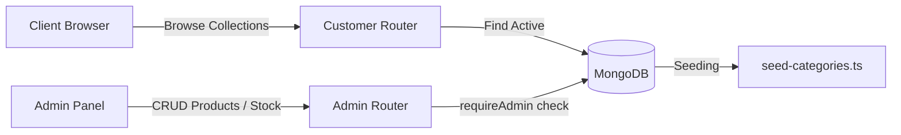

# Product Catalog Service Documentation

This service manages the product inventory, category taxonomy, brand filtering, size configurations, and active/inactive listing statuses.

---

## 1. High-Level Design (HLD)

The catalog service delivers fast read access to users browsing collections, and secure writes to admins adjusting inventory counts, products, and categories.

---

## 2. Low-Level Design (LLD)

### 2.1. File Components
* **Schema Definition**: [`server/src/models/Products.ts`](file:///c:/Ashish/E-Commerce/server/src/models/Products.ts) and [`server/src/models/Category.ts`](file:///c:/Ashish/E-Commerce/server/src/models/Category.ts)
* **Routes Mappings**:
  * Public: [`server/src/routes/customer/product.routes.ts`](file:///c:/Ashish/E-Commerce/server/src/routes/customer/product.routes.ts)
  * Protected: [`server/src/routes/admin/product.routes.ts`](file:///c:/Ashish/E-Commerce/server/src/routes/admin/product.routes.ts)
* **Client Store**: [`client/src/features/customer/products/details/store.ts`](file:///c:/Ashish/E-Commerce/client/src/features/customer/products/details/store.ts) and [`client/src/features/admin/products/use-admin-products.ts`](file:///c:/Ashish/E-Commerce/client/src/features/admin/products/use-admin-products.ts)

### 2.2. API Routes
* `GET /customer/products`: Returns list of active products with pagination, category filter, and sorting.
* `GET /customer/products/:id`: Returns details of a specific active product.
* `POST /admin/products`: Creates a new product listing.
* `PATCH /admin/products/:id`: Updates stock, description, price, or images.
* `DELETE /admin/products/:id`: Changes status to `"inactive"` (soft delete).

---

## 3. Business Logic & Rules

* **Inventory stock levels**: Stock cannot be negative. Attempting to check out more quantity than in stock throws `400 Bad Request` during checkout creation.
* **Price Markdown Math**: If `salePercentage` is greater than 0, the final customer price is calculated dynamically. The backend recalculates this price immediately before billing to prevent client price-injection attacks.
* **Catalog Status Visibility**: Customers can only view products with `status: "active"`. Soft-deleted products have `status: "inactive"` and remain visible only in the Admin dashboard.
* **Image Hosting**: Uploaded images are routed to Cloudinary via Express middleware using `multer` and `streamifier`, storing absolute HTTPS URL paths in the database.
