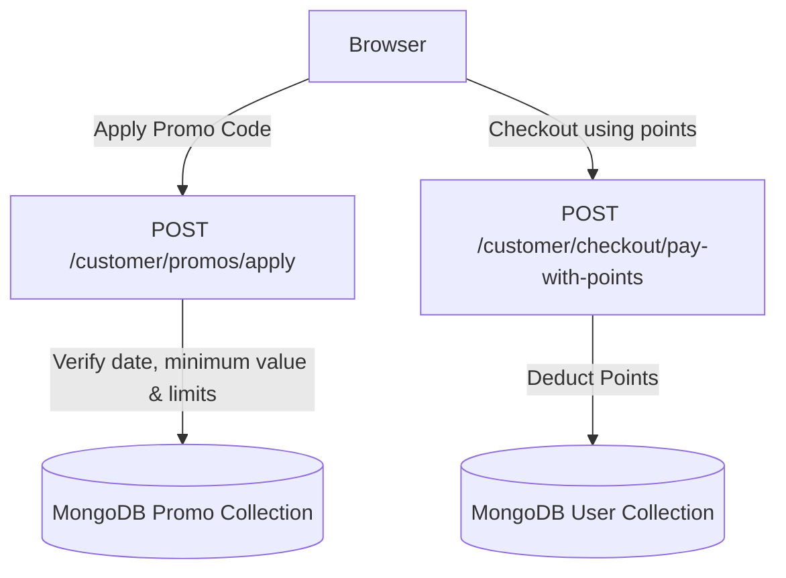

# Promos & Loyalty Program Service Documentation

This service manages coupons (promos), calculates checkout discounts, and implements the client loyalty program (points balance and points-based checkout).

---

## 1. High-Level Design (HLD)

The service provides checkout discounts based on promo codes and loyalty points, updating balances securely on the server.

---

## 2. Low-Level Design (LLD)

### 2.1. File Components
* **Schema Definitions**: [`server/src/models/Promo.ts`](file:///c:/Ashish/E-Commerce/server/src/models/Promo.ts) and [`server/src/models/User.ts`](file:///c:/Ashish/E-Commerce/server/src/models/User.ts)
* **Routes Mappings**:
  * Customer: [`server/src/routes/customer/promo.routes.ts`](file:///c:/Ashish/E-Commerce/server/src/routes/customer/promo.routes.ts)
  * Admin: [`server/src/routes/admin/promo.routes.ts`](file:///c:/Ashish/E-Commerce/server/src/routes/admin/promo.routes.ts)
* **Client Store**: [`client/src/features/customer/cart-and-checkout/store.ts`](file:///c:/Ashish/E-Commerce/client/src/features/customer/cart-and-checkout/store.ts)

### 2.2. API Routes
* `POST /customer/promos/apply`: Validates the coupon code and order subtotal, returning the discount percentage.
* `GET /admin/promos`: Returns all active promo codes.
* `POST /admin/promos`: Generates a new coupon code.

---

## 3. Business Logic & Rules

### 3.1. Coupon Constraints
To apply a promo code successfully, the subtotal of the cart must be validated against three criteria on both the client (during cart viewing) and the server (during order creation):
* **Validity window**: `now >= startsAt && now <= endsAt`.
* **Redemption capacity**: `count > 0` (coupon redemptions left).
* **Order minimum**: `subtotal >= minimumOrderValue`.

### 3.2. Loyalty Points Lifecycle
* **Earn Rate**: Currently, points are set via admin or custom loyalty actions.
* **Spend Rate**: Points convert at a fixed rate of **1 point = 1 INR**.
* **Deduction Lock**: When checkouts are verified via points, points are deducted atomically. If the order fails to save due to database locks or stock issues, points are re-credited to the user's document immediately.
